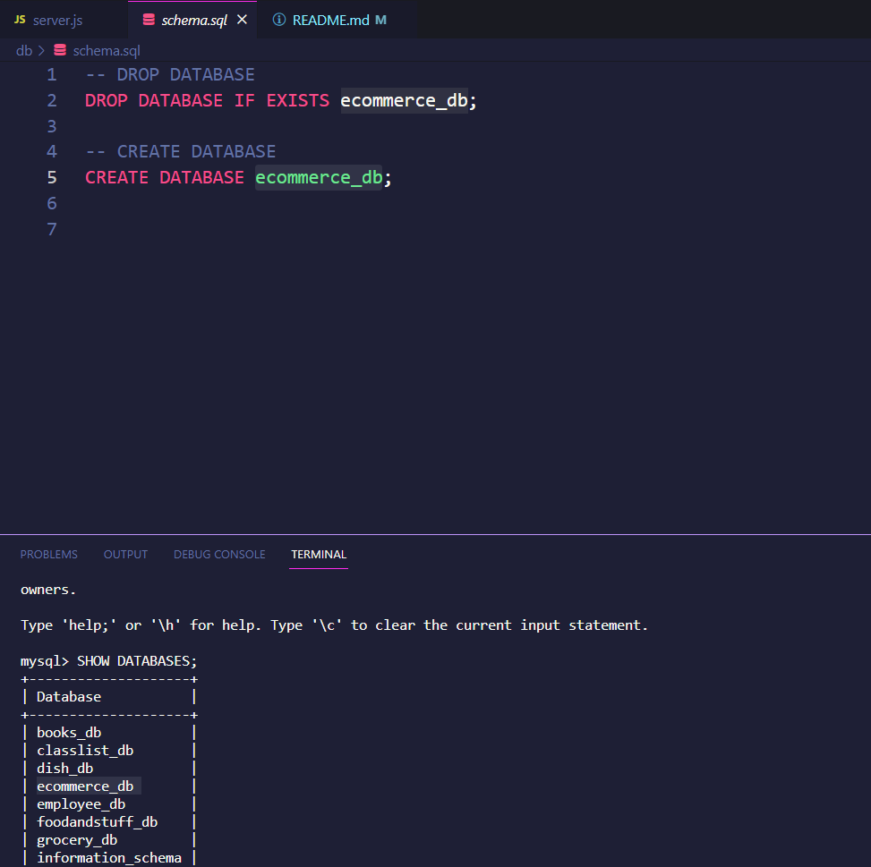
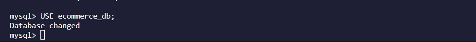

# Ecom-server
  
  

  ## Description
  This repository hosts an E-commerce Back-end server containing data. As many E-commerce sites have, there are multiple tables containing data on categories, products, and tags.

  This server has been setup with GET routes for all three sections (categories, products, and tags) and has routes for each id parameter within each table. Each route also has POST, PUT, and DELETE function to assist with making this a fully functional backend server capable of being maintained dynamically for the long term.

**User Story:** 
AS A manager at an internet retail company 
I WANT a back end for my e-commerce website that uses the latest technologies 
SO THAT my company can compete with other e-commerce companies

**Acceptance Criteria:**  
GIVEN a functional Express.js API 
WHEN I add my database name, MySQL username, and MySQL password to an environment variable file 
THEN I am able to connect to a database using Sequelize 
WHEN I enter schema and seed commands 
THEN a development database is created and is seeded with test data 
WHEN I enter the command to invoke the application 
THEN my server is started and the Sequelize models are synced to the MySQL database 
WHEN I open API GET routes in Insomnia Core for categories, products, or tags 
THEN the data for each of these routes is displayed in a formatted JSON 
WHEN I test API POST, PUT, and DELETE routes in Insomnia Core 
THEN I am able to successfully create, update, and delete data in my database

  

  ## Table of Contents
  - [Installation](#installation)
  - [Usage](#usage)
  - [Technologies](#technologies)
  - [Contributing](#contributing)
  - [Questions](#questions)
  - [License](#license)
  

  ## Installation
  You will need to start by having Node.js downloaded on your local machine.

  THEN you run npm install for all of the packages listed below.

  - MySQL2
  - Express
  - Sequelize 
  - Dotenv
  - Nodemon
  - Insomnia/browser (Routes)
  

  ## Usage
  Walkthrough Video: https://drive.google.com/file/d/1x-dK1BIHrkYpok_SdKNtL4-opPPkad1n/view  

  Initialize the program by entering (npm start) in the command line or terminal. Once you do that, you will be prompted with a menu which you can navigate with your arrows keys to view, add, update, and delete.

  - Creating the database:
  

  - USE the database:
  

  ## Technologies
 - Node.js (Several Npm Packages: Listed above)
 - JavaScript
 

 

 ## Contributing
James Kelly @ https://www.linkedin.com/in/james-kelly-b93a94150/  
MySQL2 @ https://www.npmjs.com/package/mysql2#first-query  
NPM @ https://www.npmjs.com/package/inquirer  
Dotenv @ https://www.npmjs.com/package/dotenv  

 

 ## Questions
 If you have questions, comments, or concerns please reach me at https://github.com/fabien1313
 or
 fabienmoreno1331@yahoo.com

 ## License
 **License:** MIT

Copyright (c) 2023 fabien1313

Permission is hereby granted, free of charge, to any person obtaining a copy
of this software and associated documentation files (the "Software"), to deal
in the Software without restriction, including without limitation the rights
to use, copy, modify, merge, publish, distribute, sublicense, and/or sell
copies of the Software, and to permit persons to whom the Software is
furnished to do so, subject to the following conditions:

The above copyright notice and this permission notice shall be included in all
copies or substantial portions of the Software.

THE SOFTWARE IS PROVIDED "AS IS", WITHOUT WARRANTY OF ANY KIND, EXPRESS OR
IMPLIED, INCLUDING BUT NOT LIMITED TO THE WARRANTIES OF MERCHANTABILITY,
FITNESS FOR A PARTICULAR PURPOSE AND NONINFRINGEMENT. IN NO EVENT SHALL THE
AUTHORS OR COPYRIGHT HOLDERS BE LIABLE FOR ANY CLAIM, DAMAGES OR OTHER
LIABILITY, WHETHER IN AN ACTION OF CONTRACT, TORT OR OTHERWISE, ARISING FROM,
OUT OF OR IN CONNECTION WITH THE SOFTWARE OR THE USE OR OTHER DEALINGS IN THE
SOFTWARE.